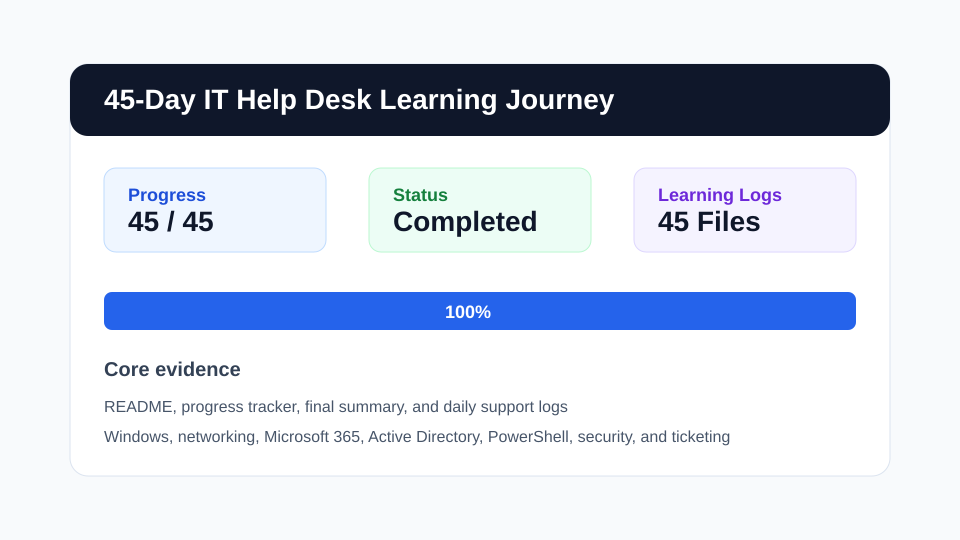
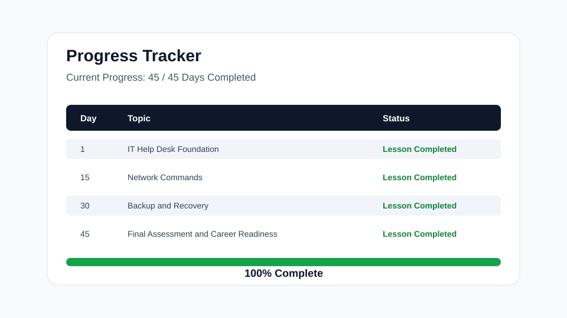
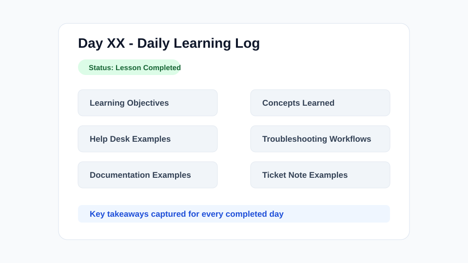

# 45-Day IT Help Desk Learning Journey


This repository documents a completed 45-day self-learning project focused on practical IT Help Desk, Service Desk, and Desktop Support readiness. It was built as a public record of consistent technical learning, troubleshooting practice, support documentation, and job preparation.

## Project Overview

The goal of this project was to build a realistic foundation for entry-level IT support roles by studying the systems, workflows, and communication habits used in day-to-day support environments. Each learning log captures the topic studied, help desk examples, troubleshooting workflows, documentation notes, and ticket-style resolution summaries.

This project demonstrates:

- A complete 45-day roadmap from IT support foundations to career readiness.
- Practical exposure to Windows support, networking, Microsoft 365, Active Directory concepts, PowerShell, security, ticketing, and documentation.
- Recruiter-friendly evidence of structured learning, consistency, and real-world support thinking.
- Professional documentation habits aligned with help desk and service desk work.

## Completion Status

| Metric | Result |
|---|---|
| Current Progress | 45 / 45 Days Completed |
| Progress Percentage | 100% |
| Learning Logs | 45 completed logs |
| Final Status | Completed |

## Repository Structure

```text
.
|-- README.md
|-- progress-tracker.md
|-- final-summary.md
|-- days/
|   |-- Day-01-IT-Help-Desk-Foundation.md
|   |-- ...
|   `-- Day-45-Final-Assessment-and-Career-Readiness.md
`-- assets/
    `-- screenshots/
```

## Complete 45-Day Roadmap

| Day | Topic | Status | Learning Log |
|---:|---|---|---|
| 1 | IT Help Desk Foundation | Lesson Completed | [Day 01](days/Day-01-IT-Help-Desk-Foundation.md) |
| 2 | Computer Hardware Basics | Lesson Completed | [Day 02](days/Day-02-Computer-Hardware-Basics.md) |
| 3 | Storage, RAM, and Boot Process | Lesson Completed | [Day 03](days/Day-03-Storage-RAM-and-Boot-Process.md) |
| 4 | Peripherals and Printer Support | Lesson Completed | [Day 04](days/Day-04-Peripherals-and-Printer-Support.md) |
| 5 | Hardware Troubleshooting Framework | Lesson Completed | [Day 05](days/Day-05-Hardware-Troubleshooting-Framework.md) |
| 6 | Windows 10/11 Basics | Lesson Completed | [Day 06](days/Day-06-Windows-10-11-Basics.md) |
| 7 | Windows Users and Permissions | Lesson Completed | [Day 07](days/Day-07-Windows-Users-and-Permissions.md) |
| 8 | File System and Disk Management | Lesson Completed | [Day 08](days/Day-08-File-System-and-Disk-Management.md) |
| 9 | Services, Startup Apps, and Task Manager | Lesson Completed | [Day 09](days/Day-09-Services-Startup-Apps-and-Task-Manager.md) |
| 10 | Software Installation and Removal | Lesson Completed | [Day 10](days/Day-10-Software-Installation-and-Removal.md) |
| 11 | Windows Updates, Drivers, and Device Manager | Lesson Completed | [Day 11](days/Day-11-Windows-Updates-Drivers-and-Device-Manager.md) |
| 12 | Windows Troubleshooting Tools | Lesson Completed | [Day 12](days/Day-12-Windows-Troubleshooting-Tools.md) |
| 13 | Networking Basics | Lesson Completed | [Day 13](days/Day-13-Networking-Basics.md) |
| 14 | TCP/IP, DNS, and DHCP | Lesson Completed | [Day 14](days/Day-14-TCP-IP-DNS-and-DHCP.md) |
| 15 | Network Commands | Lesson Completed | [Day 15](days/Day-15-Network-Commands.md) |
| 16 | Wi-Fi Troubleshooting | Lesson Completed | [Day 16](days/Day-16-Wi-Fi-Troubleshooting.md) |
| 17 | Ethernet and Cabling | Lesson Completed | [Day 17](days/Day-17-Ethernet-and-Cabling.md) |
| 18 | VPN and Remote Access | Lesson Completed | [Day 18](days/Day-18-VPN-and-Remote-Access.md) |
| 19 | Network Troubleshooting Project | Lesson Completed | [Day 19](days/Day-19-Network-Troubleshooting-Project.md) |
| 20 | Active Directory Basics | Lesson Completed | [Day 20](days/Day-20-Active-Directory-Basics.md) |
| 21 | AD Users, Groups, and Permissions | Lesson Completed | [Day 21](days/Day-21-AD-Users-Groups-and-Permissions.md) |
| 22 | Password Resets and Account Lockouts | Lesson Completed | [Day 22](days/Day-22-Password-Resets-and-Account-Lockouts.md) |
| 23 | Group Policy Basics | Lesson Completed | [Day 23](days/Day-23-Group-Policy-Basics.md) |
| 24 | Microsoft 365 Basics | Lesson Completed | [Day 24](days/Day-24-Microsoft-365-Basics.md) |
| 25 | Outlook Troubleshooting | Lesson Completed | [Day 25](days/Day-25-Outlook-Troubleshooting.md) |
| 26 | Teams, OneDrive, and SharePoint | Lesson Completed | [Day 26](days/Day-26-Teams-OneDrive-and-SharePoint.md) |
| 27 | Ticketing Systems and ITIL | Lesson Completed | [Day 27](days/Day-27-Ticketing-Systems-and-ITIL.md) |
| 28 | Security Basics | Lesson Completed | [Day 28](days/Day-28-Security-Basics.md) |
| 29 | Endpoint Security | Lesson Completed | [Day 29](days/Day-29-Endpoint-Security.md) |
| 30 | Backup and Recovery | Lesson Completed | [Day 30](days/Day-30-Backup-and-Recovery.md) |
| 31 | PowerShell Basics | Lesson Completed | [Day 31](days/Day-31-PowerShell-Basics.md) |
| 32 | PowerShell Help Desk Tasks | Lesson Completed | [Day 32](days/Day-32-PowerShell-Help-Desk-Tasks.md) |
| 33 | Remote Support Tools | Lesson Completed | [Day 33](days/Day-33-Remote-Support-Tools.md) |
| 34 | Documentation and Knowledge Base Writing | Lesson Completed | [Day 34](days/Day-34-Documentation-and-Knowledge-Base-Writing.md) |
| 35 | Professional Communication | Lesson Completed | [Day 35](days/Day-35-Professional-Communication.md) |
| 36 | Slow Computer Troubleshooting Scenario | Lesson Completed | [Day 36](days/Day-36-Slow-Computer-Troubleshooting-Scenario.md) |
| 37 | Login and Account Issues | Lesson Completed | [Day 37](days/Day-37-Login-and-Account-Issues.md) |
| 38 | Network and VPN Support Scenarios | Lesson Completed | [Day 38](days/Day-38-Network-and-VPN-Support-Scenarios.md) |
| 39 | Printer and Shared Drive Issues | Lesson Completed | [Day 39](days/Day-39-Printer-and-Shared-Drive-Issues.md) |
| 40 | Microsoft 365 Support Scenarios | Lesson Completed | [Day 40](days/Day-40-Microsoft-365-Support-Scenarios.md) |
| 41 | Resume, LinkedIn, and GitHub Profile | Lesson Completed | [Day 41](days/Day-41-Resume-LinkedIn-and-GitHub-Profile.md) |
| 42 | Technical Interview Preparation | Lesson Completed | [Day 42](days/Day-42-Technical-Interview-Preparation.md) |
| 43 | Behavioral Interview Preparation | Lesson Completed | [Day 43](days/Day-43-Behavioral-Interview-Preparation.md) |
| 44 | Mock Support Shift | Lesson Completed | [Day 44](days/Day-44-Mock-Support-Shift.md) |
| 45 | Final Assessment and Career Readiness | Lesson Completed | [Day 45](days/Day-45-Final-Assessment-and-Career-Readiness.md) |

## Technologies and Tools Learned

- Windows 10/11 support tools: Settings, Control Panel, Device Manager, Event Viewer, Reliability Monitor, Task Manager, Services, Disk Management, Safe Mode, System Restore, SFC, and DISM.
- Networking tools and concepts: TCP/IP, DNS, DHCP, default gateway, subnet basics, Wi-Fi, Ethernet, VPN, `ipconfig`, `ping`, `tracert`, `nslookup`, and `netstat`.
- Microsoft 365 support areas: Outlook, Teams, OneDrive, SharePoint, account access, license checks, profile repair, sync troubleshooting, and service health awareness.
- Active Directory concepts: users, groups, permissions, password resets, lockouts, group policy basics, and least privilege.
- PowerShell basics: command discovery, system information checks, service review, event log review, process checks, and support documentation commands.
- Security fundamentals: phishing awareness, MFA, endpoint protection, patching, secure passwords, account hygiene, backups, and incident escalation.

## Help Desk Skills Learned

- Triage user issues by impact, urgency, affected systems, and business context.
- Gather clear information from users while keeping communication calm and respectful.
- Apply a consistent troubleshooting process: identify, isolate, test, resolve, document, and follow up.
- Create ticket notes that summarize symptoms, actions taken, resolution, and user confirmation.
- Escalate issues with clean evidence and relevant technical details.
- Write clear internal documentation and knowledge base notes.

## Troubleshooting Skills

- Slow computer diagnosis using Task Manager, startup app review, disk capacity checks, update checks, and malware/security indicators.
- Login and account issue resolution using password reset workflows, lockout checks, profile checks, and access validation.
- Network issue isolation across device, Wi-Fi, Ethernet, DNS, DHCP, gateway, VPN, and service availability layers.
- Printer support for drivers, queues, connectivity, default printer settings, paper and toner checks, and shared printer access.
- Microsoft 365 troubleshooting for Outlook sync, Teams access, OneDrive sync, SharePoint permissions, and account licensing.

## Windows Support

The Windows portion of the roadmap focused on practical support tasks a technician handles regularly: user profiles, permissions, updates, drivers, services, startup apps, storage health, file paths, system recovery, and built-in troubleshooting tools. The logs show how each tool supports real user issues and how to document work clearly.

## Networking Support

The networking portion covered the foundation needed to troubleshoot connectivity issues in a help desk role. Topics included IP addressing, DNS, DHCP, Wi-Fi, Ethernet cabling, VPN access, remote work scenarios, and command-line checks used to identify whether an issue is local, network-based, or service-related.

## Microsoft 365 Support

The Microsoft 365 section focused on user productivity support, including Outlook profile issues, mailbox sync problems, Teams access, OneDrive sync, SharePoint permissions, licensing checks, and service health review. The emphasis was on repeatable steps and clear communication with users.

## Active Directory Support

The Active Directory section documented core identity concepts used in support environments: user objects, security groups, organizational units, password resets, lockouts, group policy basics, access requests, and least privilege. The goal was to understand common account support workflows and escalation details.

## PowerShell Support

The PowerShell section introduced practical command-line habits for help desk tasks. Topics included discovering commands with `Get-Help`, checking system and network details, reviewing services and processes, collecting event log details, and documenting command output in tickets.

## Security Support

The security portion covered daily help desk responsibilities such as phishing recognition, MFA support, password hygiene, endpoint protection, patching, secure device handling, backup awareness, and knowing when to escalate suspicious activity.

## Project Visuals

| Area | Visual |
|---|---|
| Repository overview |  |
| Progress tracker |  |
| Daily learning log format |  |

## Final Completion Statement

This 45-day IT Help Desk learning journey is complete. The repository now represents a structured, professional, and recruiter-friendly record of hands-on learning across Windows support, networking, Microsoft 365, Active Directory concepts, PowerShell, security, ticketing, documentation, and real-world troubleshooting scenarios.
